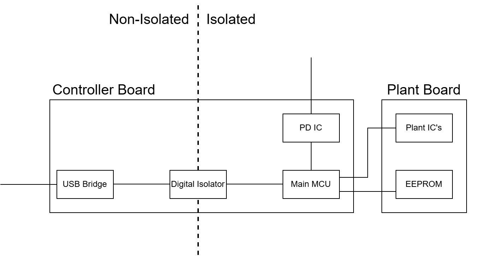

# Features
- Isolated plant
- Plant-ID, Plant cal-data (eeprom)
- USB-PD powered

# Design

# BOM
## Main Board

|Component|Price|Characteristics|
|--|--|--|
|[STM32H7R3V8T6](https://www.st.com/resource/en/datasheet/stm32h7r3a8.pdf)| 7.89 USD| 600 Mhz, 67 GPIO|
|[FT232HL](https://ftdichip.com/products/ft232hl/)|4.09 USD| USB Hi-Speed to Single Channel Serial UART/FIFO/JTAG/SPI/I2C IC, LQFP-48|
|[PCI Express Min](https://www.digikey.com.mx/en/products/detail/jae-electronics/MM60-52B1-E1-R650/2071034)|2.68 USD|CONN PCI EXP MIN FML 52POS 0.031|
|USB type C Connector|||
|DC DC Converter|||
|Mix Components(Leds)|||
|Power delivery IC|||
|[ISOW14x2](https://www.ti.com/lit/ds/symlink/iso7740-q1.pdf?HQS=dis-dk-null-digikeymode-dsf-pf-null-wwe&ts=1725598433136)|| Reinforced Quad-Channel Digital Isolators|

## FT232HL
### Requirements
To use any kind of interface (SPI, I2c, JTAG, or a proprietary protocol) it's require to send commands down the data stream
- 12Mhz oscillator
- [External EEPROM - 93LC56BT-I/OT](https://ww1.microchip.com/downloads/en/DeviceDoc/21794G.pdf) 
- LC Filter

# INFO
[A Primer on USB Type-C® and USB Power Delivery Applications and Requirements](https://www.ti.com/lit/SLYY109B) \
[USB PD: Power Delivery for Your Next Project](https://resources.altium.com/p/usb-power-delivery-your-next-project) \
[AN232B-04 Data Throughput, Latency and Handshaking](https://ftdichip.com/wp-content/uploads/2020/08/AN232B-04_DataLatencyFlow.pdf)\
[FT2232D/H Fast Opto-Isolated Serial Interface Mode](https://www.ftdichip.com/Support/Documents/AppNotes/AN_131_FT2232D_H_Fast%20Opto-Isolated%20Serial%20Interface%20mode.pdf)\
[N2232-02 Bit Mode Functions for the FT223](https://www.ftdichip.com/Documents/AppNotes/AN2232C-02_FT2232CBitMode.pdf)\
[Examples  for the JTAG interface with Labview](https://ftdichip.com/software-examples/mpsse-projects/ftcjtag-examples/)

